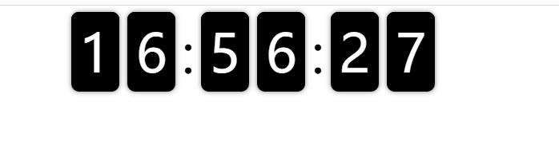

# vue-flip-clock
时钟翻牌倒计时，参考兔子先生

[ [更新日志](https://github.com/zj-197/vue-flip-clock/master/CHANGELOG.md) ]


## 一、安装使用


### 1. 安装

```bash
# npm 安装
npm install vue-flip-clock
```
```bash
# yarn 安装
yarn add vue-flip-clock
```


服务器渲染 `nuxt` 解决方案 设置为 `ssr: false`
```js
module.exports = {
  ...
  build: {
    vendor: [
      'vue-flip-clock
    ...
    plugins: [
      { src: '~/plugins/vue-flip-clock', ssr: false }
    ]
  }
}
```
`Vue2` 组件内引入
```js
import { FlipClock }  from 'vue-flip-clock' 
components: {
    FlipClock
}
```

`Vue2` 全局引入
```js
import FlipClock from 'FlipClock'
Vue.use(FlipClock)
```


`nuxt` 引入方式
```js
if(process.browser) {
    flipClock = require('vue-flip-clock')
  Vue.use(flipClock.default)
}
```

### 3. 代码中使用

```html
<vue-flip-clock
  ref="cropper"
  mode="time"
></vue-flip-clock>
```


## 二、文档

### 1. props


名称 | 功能                             | 默认值       | 可选值                                       
--- |--------------------------------|-----------|------------------------------
mode    | 模式                             | time      | `time` `{h}{i}{s}`, `{i}{s}`, `{s}`       
initValue | 默认的倒计时时间                       | --        | 90i, 1h , 30s, 任意分钟，任意小时，任意秒
flipperClass | 翻牌器的自定义class可用于修改背景，字体颜色等      | --                           
flipperContainerClass | 翻牌器容器的自定义class可用于修改字体颜色等       | --

### 2. 效果图


